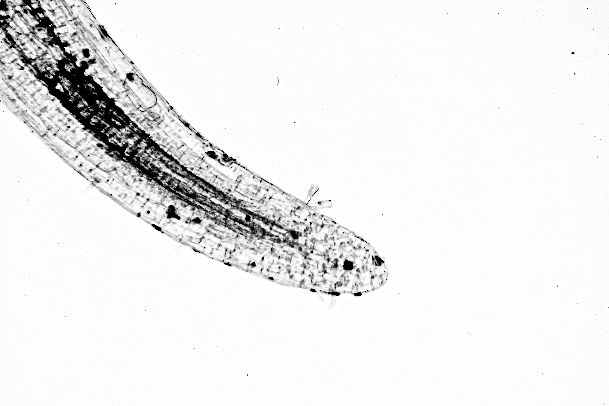
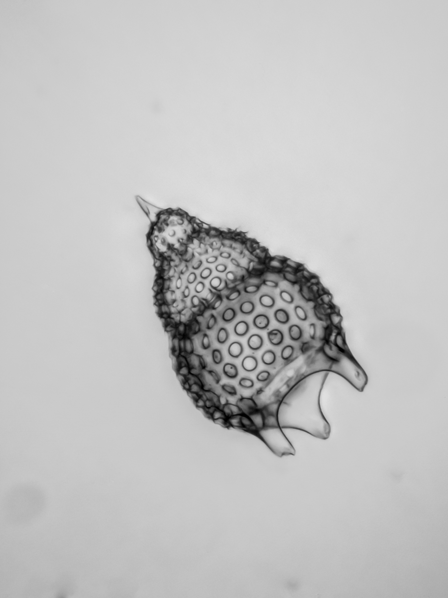

# gimp-photocopy-and-stack

`script-fu-photocopy-stack` is a version 2 GIMP Script-Fu script that creates 
something that looks like a drawn image from a focus stacked series. It takes a 
focus stack series opened as layers, on each layer it applies the photocopy 
plugin, makes white transparent, and puts this all on a white background.

## Installation

Copy `photocopy-stack.scm` to your GIMP `scripts` directory and refresh Script-Fu scripts.

"Photocopy and stack" will appear in the "Artistic" Filters menu.

## Examples

### Duckweed root.

The tip of a duckweed root with a few diatoms hanging on. 12 Image focus stacked with Zerene Stacker.

The same stack after "Photocopy and stack..." with `MaskRadius:0.5`, `Sharpness:0.5`, `PercentBlack:1.0`, and `PercentWhite:0.2`

### Radiolarian.

A radiolarian from a prepared slide. 14 Image focus stacked with Zerene Stacker.

The same stack after "Photocopy and stack..." with `MaskRadius:0.5`, `Sharpness:0.7`, `PercentBlack:1.0`, and `PercentWhite:0.3`

